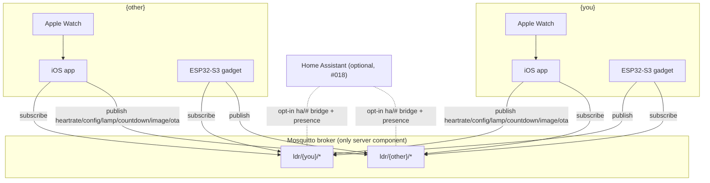

# Architecture

> **Living document.** This reflects current, final decisions. Update it in place as the
> system evolves — don't fork a new doc.

`ldr-connect` is a long-distance-relationship gadget for two people — referred to
throughout this documentation as `{you}` and `{other}`. Two identical hardware devices
and two iPhone apps talk to each other through one shared server component.

## Core principle

**A single Mosquitto MQTT broker is the only server component and the single source of
truth.** It is deliberately dumb — pure pub/sub transport, zero business logic. All logic
(state, staleness, rendering, config) lives in the firmware and the iOS app, not the
broker. Home Assistant can optionally attach to the same broker as a third client type
(see [#018 Home Assistant Integration](features/018-home-assistant.md)) — it never
becomes a server component itself.

## System at a glance

Two identical gadgets, two iPhone apps, one broker. Monorepo layout:

| Path | Contents |
| --- | --- |
| `firmware/` | Rust firmware (ESP32-S3) |
| `ios/` | SwiftUI app |
| `broker/` | Mosquitto config (TLS, credentials, ACLs) |
| `schemas/` | Shared payload schemas |
| `docs/` | This documentation |

See [mqtt-topics.md](mqtt-topics.md) for the full topic contract and
[hardware.md](hardware.md) for the per-gadget bill of materials.

## Components

### 1. Hardware client (per person)

ESP32-S3, firmware in Rust using `esp-idf-hal` + `esp-idf-svc` — the **std** approach,
not `no_std`, chosen because ESP-IDF provides mature WiFi/TLS/MQTT/OTA support.

- Publishes its own data under `ldr/{you}/*`, subscribes to the partner's topics under
  `ldr/{other}/*`.
- Incoming events (hug/kiss) are signaled **only via hardware**: RGB lamp effects + e-ink
  status.
- **No push notifications (no APNs).** Deliberate decision to avoid any backend service
  beyond the broker.

### 2. iOS app (per person)

SwiftUI + CocoaMQTT, over TLS.

- **Foreground-only MQTT connection** — iOS forbids persistent background connections;
  acceptable here because notifications are hardware-based, not app-based.
- Configures the gadget: button mapping, lamp color, server settings — published as
  **retained config topics**.
- Displays all partner state.
- Sends interactions (hug/kiss) and image messages; sets the shared reunion countdown.
- Buffers time-series data locally for charts — there is no server-side history.
- Performs OTA firmware uploads over MQTT (see [OTA over MQTT](#ota-over-mqtt) below).

### 3. Mosquitto broker

- Retained messages hold last-known state; **Last Will & Testament (LWT)** provides
  presence detection.
- **TLS + per-device credentials + ACLs**: each client may **write** only its own
  `ldr/{you}/#`, and **read** both its own `ldr/{you}/#` and the partner's
  `ldr/{other}/#` — own-topic read is needed for `config`, `lamp`, `countdown`, and the
  `ping` self-loopback (see
  [mqtt-topics.md § Conventions](mqtt-topics.md#conventions)).
- The ESP32 cannot run WireGuard/netbird, so gadgets connect via **TLS directly to the
  exposed broker** (no VPN hop).
- **Optional Home Assistant client role** (see
  [#018 Home Assistant Integration](features/018-home-assistant.md)): its own
  credentials, scoped by ACL to **read** `ldr/+/ha/#`, `ldr/+/presence`, and
  `homeassistant/#`, and **write** only `ldr/+/ha/+/set`, `ldr/+/ha/+/press`, and
  `homeassistant/status`. HA has **no** ACL access to the encrypted contract topics
  (`status`, `interaction`, `heartrate`, `env`, `lamp`, `config`, `countdown`, `image`) —
  the `ha` subtree is a separate, deliberate plaintext export surface. Gadgets in turn
  get **write** on `homeassistant/#` (their own discovery configs) and **read** on
  `homeassistant/status` (HA's birth message).

## Heartbeat data flow

**There is no heart-rate sensor on the gadget.** Heart rate comes exclusively from the
**Apple Watch via HealthKit** (`HKWorkoutSession` + `HKLiveWorkoutBuilder`) in the iOS
app, published to `ldr/{you}/heartrate` only while the app is foregrounded and a
workout is active.

Consequence: **heartbeat is intermittent by design.** The partner's OLED animates the
received BPM while values are fresh (timestamp-based staleness check) and falls back to a
calm idle animation otherwise.

## Display split

| Display | Content | Why |
| --- | --- | --- |
| e-ink | Partner's local time / both time zones, status/mood, hug-kiss state, connection quality, reunion countdown, image-message takeover, quiet-hours moon icon + wake summary | Static content; e-ink must be refreshed sparingly |
| OLED | Heartbeat animation (sleeps after ≤10 min of idle animation and during quiet hours — burn-in protection, see [features/010-quiet-hours.md](features/010-quiet-hours.md)) | Dynamic content; OLED refreshes in ~20 ms |

## OTA over MQTT

Chosen over HTTPS-OTA to keep the broker the only server component.

1. The iOS app selects the `.bin` (built via `espflash save-image`) and computes its
   SHA-256.
2. It publishes a **retained offer** on `ldr/{you}/ota/offer` (version, size, sha256,
   chunk count/size).
3. It streams application-level chunks of **2–4 KB raw binary** on
   `ldr/{you}/ota/chunk`, at **QoS 1**.
4. Firmware uses `esp-idf-svc`'s `EspOta`: `initiate_update()` → `write()` per chunk
   (streamed straight to flash, never fully buffered) → SHA-256 verify → `complete()` →
   restart.

Supporting configuration:

- **Dual OTA partition table** — two app slots, requiring 16 MB flash.
- `CONFIG_BOOTLOADER_APP_ROLLBACK_ENABLE` — automatic rollback on boot failure.
- `mark_running_slot_valid()` called after a successful self-test on the new firmware.
- `CONFIG_MQTT_BUFFER_SIZE` raised to **8 KB** to accommodate chunk size.

**Fallback:** HTTPS-OTA is the explicit fallback plan if MQTT-OTA proves unstable — in
that case the offer topic would carry a URL instead of streaming chunks.

## Security & provisioning

TLS secures the broker connection, but the broker itself is still exposed to the
internet. On top of TLS, intimate topics carry an **end-to-end payload-encryption
layer** — the broker only ever relays ChaCha20-Poly1305 ciphertext for these, making it
zero-knowledge for intimate content. Keys come from a per-couple pairing ceremony (shake
to generate, scan each other's QR to pair); see
[security.md](features/002-security.md) for the full design.

Provisioning happens over a **local SoftAP channel**: a blank gadget opens its own WiFi
network and a local HTTP server so the app can hand it home-WiFi credentials, broker
details, and key material directly — no secrets are ever baked into firmware. After
setup, the gadget keeps a persistent, mDNS-announced local management channel open on the
home network for later maintenance (WiFi/broker/key changes), authenticated with the same
AEAD envelope used for MQTT payloads. See
[setup.md](features/001-setup.md) for the full flow.

## Topology diagram

## See also

- [MQTT Topics](mqtt-topics.md) — the full topic/payload contract, retained flags, ACLs.
- [Hardware](hardware.md) — per-gadget bill of materials and wiring notes.
- [Features](features/_template.md) — one doc per user-facing feature.
